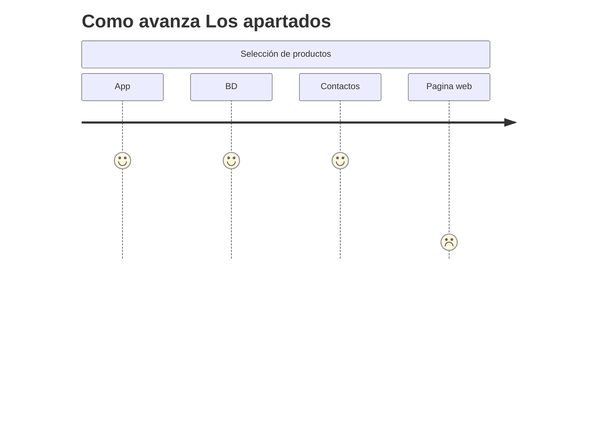
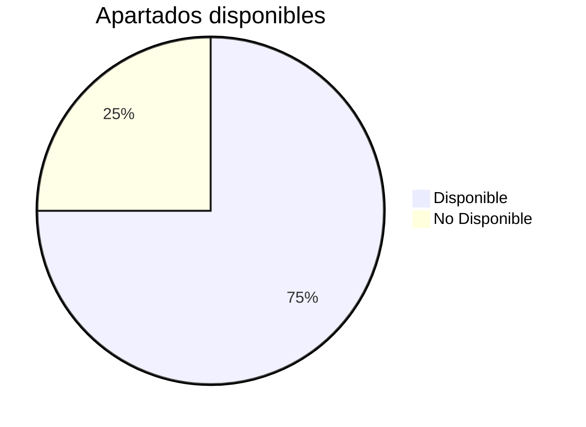
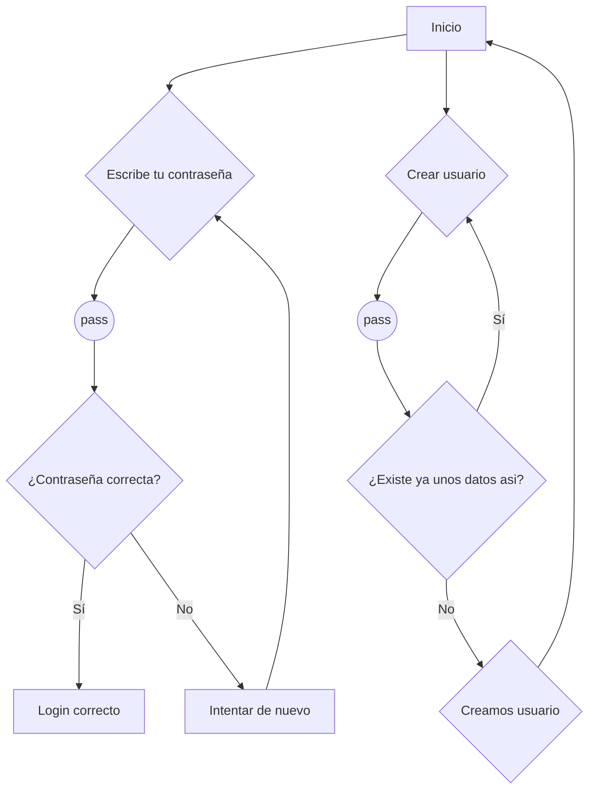
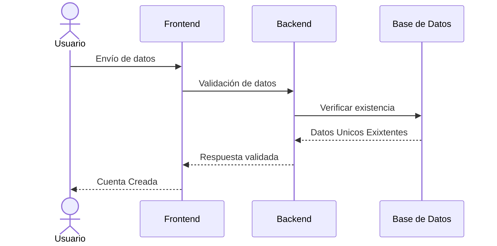
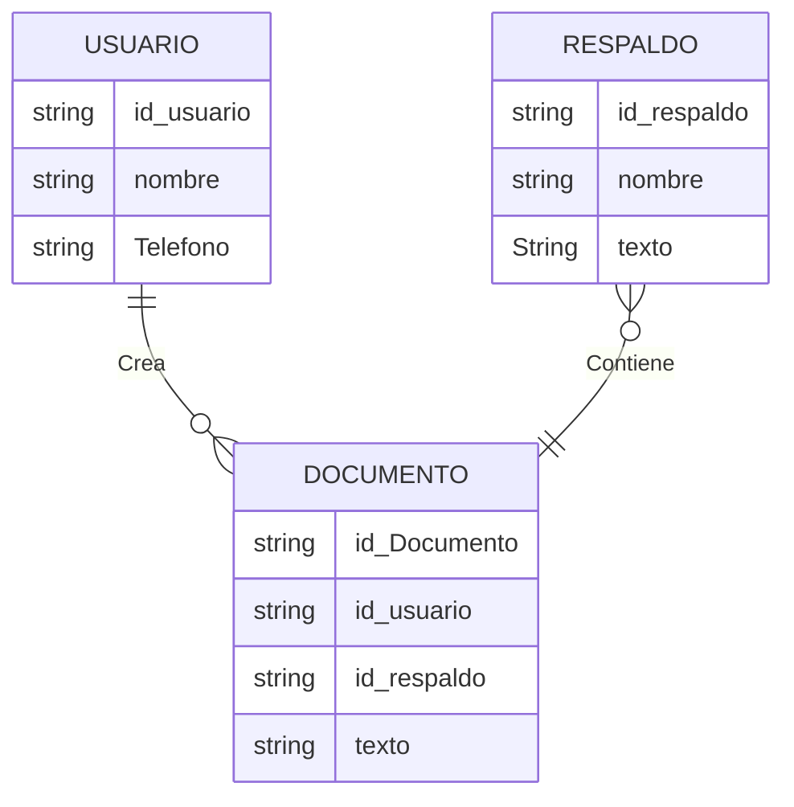
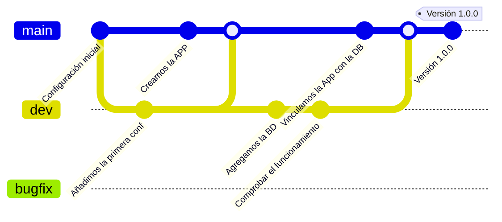
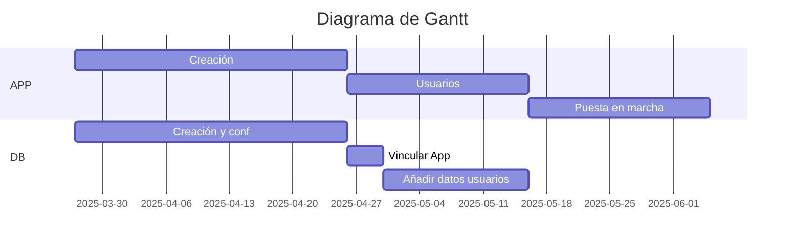
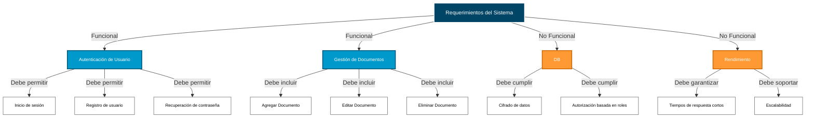

# By-More-Doc
### ***¿Que es exactamente By-More-Doc?*** 

By-More-Doc es una aplicacion movil que nacio con la idea de hacer que aquel que quiera información documentada o simplemente saciar su curiosidad tenga un lugar donde compartir absolutamente todo aquello que crea que pueda interesarle a alguien o que quieran encontrar documentos concretos.
***
***<h1> Objetivos de la aplicación</h1>***

- Romper la privatización y compra venta de información 
- Juntar a fanaticos de todos los tipos
- Facilitar el acceso a documentos
- Compartir la información
- Incitar la colaboración
 ***

 |<u> Apartados<u> | Disponible | Ultima actualización |
|----------------|------------|----------------|
| App           | 
Sí
         |
30/1/2025
 |
| BD            | 
Sí
|
30/1/2025 
|
| Contactos     | 
Sí
|
30/1/2025 
|
| Pagina web    | 
No 
||

[Un video para repasar conceptos](https://www.youtube.com/watch?v=U709qY6S9rA&list=PLU8oAlHdN5BktAXdEVCLUYzvDyqRQJ2lk&index=1)

***<h1>Creación De Usuario</h1>***

***<h1>Creación De Documentos (tablas)</h1>***

***<h1>Diagrama Git (Panificación)</h1>***

***<h1>Minimos funcionalidad</h1>***

***<h1>Contactos</h1>***

<marcos.lasheras.trzn@gmail.com>

 

